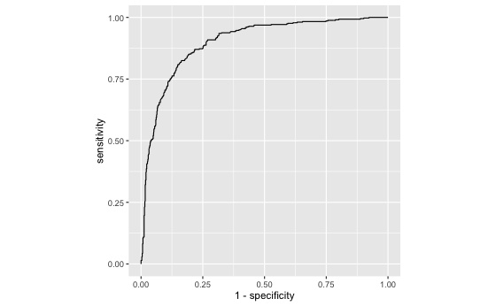

## Multiple logistic regression

Building a MLR model as a binary classifier that assess what product is likely to be purchased and what aids such behaviour.
Model was developed on a train data set and evaluated on a test data set (80/20 split).
I also looked at the performance of the best model (accuracy - confusion matrix, ROC, AUC, GINI).

Example - ROC curve of my best model 

